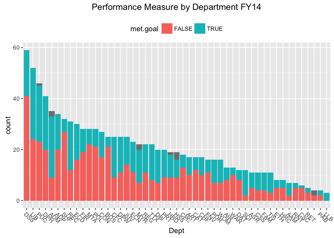
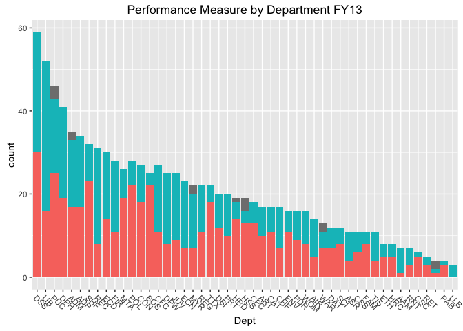

    library(dplyr)
    library(ggplot2)

    ## Warning: package 'ggplot2' was built under R version 3.2.3

    # html_document

Citywide Performance
--------------------

    #https://data.sfgov.org/api/views/5x94-tptc/rows.csv?accessType=DOWNLOAD
    perf.measures.FY14 <- read.csv('../data/Citywide_Performance_Measurement_Annual_Report_FY14_Dataset.csv')

    perf.measures.FY13 <- read.csv('../data/Citywide_Performance_Measurement_Annual_Report_FY13_Dataset.csv')

How wide of a margin should be given to "On target is positive" goals?

    group_by(perf.measures.FY14, Performance.Pattern) %>%
        summarise(count = n())

    ## Source: local data frame [3 x 2]
    ## 
    ##        Performance.Pattern count
    ## 1 Above target is positive   796
    ## 2 Below target is positive   115
    ## 3    On target is positive    90

    #subset(perf.measures.FY14, Performance.Pattern == 'On target is positive')

Acounting for diffent units might be... interesting depending what we
decide to do.

    group_by(perf.measures.FY14, Unit.of.Measure) %>%
        summarise(count = n())

    ## Source: local data frame [3 x 2]
    ## 
    ##   Unit.of.Measure count
    ## 1        Currency    52
    ## 2         General   596
    ## 3         Percent   353

There might be an opportunity to cross over with 311 data here? Not a
ton of info though.

    nrow(subset(perf.measures.FY14, Program == '311 CUSTOMER SERVICE CENTER'))

    ## [1] 5

    goal.evaluater <- function(row, actual.col, target.col){
        actual = as.numeric(row[actual.col])
        target = as.numeric(row[target.col])
        if(row['Performance.Pattern'] == 'Below target is positive'){
            actual < target
        }else if(row['Performance.Pattern'] == 'Above target is positive'){
                actual > target
        }else{
            # Checked within 5% is good for now, needs more research
            (target-actual)/target < .05 & (target-actual)/target > -.05
        }
    }

    perf.measures.FY14$met.goal <- apply(perf.measures.FY14, 1, goal.evaluater, 'FY.2014...Total.Actual.Data', 'FY.2014...Total.Target.Data')

    perf.measures.FY13$met.goal <- apply(perf.measures.FY13, 1, goal.evaluater, 'FY.2013...Total.Actual.Data', 'FY.2013...Total.Target.Data')

    success.by.pattern <-table(perf.measures.FY14[c('met.goal', 'Performance.Pattern')])
    success.by.pattern

    ##         Performance.Pattern
    ## met.goal Above target is positive Below target is positive
    ##    FALSE                      416                       66
    ##    TRUE                       370                       49
    ##         Performance.Pattern
    ## met.goal On target is positive
    ##    FALSE                    58
    ##    TRUE                     31

    apply(success.by.pattern, 2, function(col){col[2]/(col[1]+col[2])})

    ## Above target is positive Below target is positive    On target is positive 
    ##                0.4707379                0.4260870                0.3483146

    ##      Dept                         Department
    ## 1     AAM                   ASIAN ART MUSEUM
    ## 8     ADM            ADMINISTRATIVE SERVICES
    ## 43    ADP                    ADULT PROBATION
    ## 77    AIR                 AIRPORT COMMISSION
    ## 90    ART                    ARTS COMMISSION
    ## 107   ASR                ASSESSOR / RECORDER
    ## 118   BOS               BOARD OF SUPERVISORS
    ## 143   CAT                      CITY ATTORNEY
    ## 160   CFC   CHILDREN AND FAMILIES COMMISSION
    ## 185   CHF    CHILDREN YOUTH & THEIR FAMILIES
    ## 202   CON                         CONTROLLER
    ## 229   CPC                      CITY PLANNING
    ## 247   CSC           CIVIL SERVICE COMMISSION
    ## 253   CSS             CHILD SUPPORT SERVICES
    ## 264   DAT                  DISTRICT ATTORNEY
    ## 276   DBI                BUILDING INSPECTION
    ## 296   DPH                      PUBLIC HEALTH
    ## 337   DPW                       PUBLIC WORKS
    ## 362   DSS                     HUMAN SERVICES
    ## 421   ECD               EMERGENCY MANAGEMENT
    ## 451   ECN ECONOMIC AND WORKFORCE DEVELOPMENT
    ## 474   ENV                        ENVIRONMENT
    ## 490   ETH                  ETHICS COMMISSION
    ## 498   FAM                   FINE ARTS MUSEUM
    ## 509   FIR                    FIRE DEPARTMENT
    ## 537   HRC            HUMAN RIGHTS COMMISSION
    ## 545   HRD                    HUMAN RESOURCES
    ## 564   HSS              HEALTH SERVICE SYSTEM
    ## 583   JUV                 JUVENILE PROBATION
    ## 608   LIB                     PUBLIC LIBRARY
    ## 660   LLB                        LAW LIBRARY
    ## 663   MTA    MUNICIPAL TRANSPORTATION AGENCY
    ## 691   MYR                              MAYOR
    ## 713   PAB                   BOARD OF APPEALS
    ## 717   PDR                    PUBLIC DEFENDER
    ## 733   POL                             POLICE
    ## 761   PRT                               PORT
    ## 781   PUC        PUBLIC UTILITIES COMMISSION
    ## 827   REC     RECREATION AND PARK COMMISSION
    ## 858   REG                          ELECTIONS
    ## 880   RET                  RETIREMENT SYSTEM
    ## 885   RNT             RENT ARBITRATION BOARD
    ## 892   SCI                ACADEMY OF SCIENCES
    ## 904   SHF                            SHERIFF
    ## 936   TIS                         TECHNOLOGY
    ## 947   TTX            TREASURER/TAX COLLECTOR
    ## 969   WAR                       WAR MEMORIAL
    ## 982   WOM                    STATUS OF WOMEN
    ## 998                         FINE ARTS MUSEUM
    ## 999          MUNICIPAL TRANSPORTATION AGENCY
    ## 1000

Can't forget there are programs that didnt have measures.

Budget
------

    budget <- read.csv('../data/Budget.csv')

Most of the departments are also present in peformance measures FY14

    budget.depts <- unique(budget$Department.Code)
    perf.depts <- unique(perf.measures.FY14$Dept)
    length(intersect(budget.depts, perf.depts))

    ## [1] 48

    # the only value in perf.depts not in budget are blanks.
    # So every department has budget entries!
    setdiff(perf.depts, intersect(budget.depts, perf.depts))

    ## [1] ""

    no.perf <- setdiff(budget.depts,perf.depts)

    no.perf.budget <- subset(budget, Department.Code %in% no.perf)

    # Do not have matching FY14 performance values
    unique(no.perf.budget$Department)

    ## [1] Superior Court                       
    ## [2] PUC Water Department                 
    ## [3] PUC Wastewater Enterprise            
    ## [4] PUC Hetch Hetchy                     
    ## [5] General Fund Unallocated             
    ## [6] General City Responsibility          
    ## [7] County Education Office              
    ## [8] Community Investment & Infrastructure
    ## 56 Levels: Academy of Sciences Adult Probation ... War Memorial

will soon be relasing all KPI for the city Look at baltimore daily
report card sf government barameter through city controlers office. data
for good exchange

Look at city controler's office website. City performance section

Optimal distribution of ambulances

Rail and Bus

Affordable public housing (how do HOA fees affect people)

    dept.budget.2014 <- subset(budget,Fiscal.Year == 2014) %>%
        group_by(Department.Code) %>%
        summarise(sum(Amount))

    dept.budget.2013 <- subset(budget,Fiscal.Year == 2013) %>%
        group_by(Department.Code) %>%
        summarise(sum(Amount))

    dept.budget.2013

    ## Source: local data frame [56 x 2]
    ## 
    ##    Department.Code sum(Amount)
    ## 1              AAM    16626450
    ## 2              ADM   584004102
    ## 3              ADP    49706398
    ## 4              AIR  1602090332
    ## 5              ART    20817920
    ## 6              ASR    42327168
    ## 7              BOS    24493008
    ## 8              CAT    17475822
    ## 9              CFC    61124514
    ## 10             CHF   242465006
    ## ..             ...         ...

    merge(dept.budget.2013, dept.budget.2014, by = 'Department.Code')

    ##    Department.Code sum(Amount).x sum(Amount).y
    ## 1              AAM      16626450      17488878
    ## 2              ADM     584004102     329479846
    ## 3              ADP      49706398      52977112
    ## 4              AIR    1602090332    1644852142
    ## 5              ART      20817920      26496286
    ## 6              ASR      42327168      42889160
    ## 7              BOS      24493008      25445720
    ## 8              CAT      17475822      29865430
    ## 9              CFC      61124514      89918422
    ## 10             CHF     242465006     286624508
    ## 11             CII     290610096     622334186
    ## 12             CON      23632656      28938100
    ## 13             CPC      53937878      58464114
    ## 14             CRT     250192984     251653196
    ## 15             CSC       1097852       1225004
    ## 16             CSS      25689030      26549962
    ## 17             CWP     471078024     494369574
    ## 18             DAT      82341538      90936154
    ## 19             DBI     100078346     157185478
    ## 20             DPH    3284878257    3750332586
    ## 21             DPW     162246242     184185788
    ## 22             DSS    1345895840    1407433768
    ## 23             ECD      94306326     135717122
    ## 24             ECN      79849922      67982934
    ## 25             ENV      31975632      28855514
    ## 26             ETH       8311094       9063900
    ## 27             FAM      32190940      33857936
    ## 28             FIR     644080044     658690388
    ## 29             GEN     708410008     831166050
    ## 30             HHP     193899050     202123964
    ## 31             HRC       2431548       3057204
    ## 32             HRD      18757114      22452356
    ## 33             HSS        334710        346710
    ## 34             JUV      71215674      73471578
    ## 35             LIB     184684032     200945630
    ## 36             LLB       1476358       2569990
    ## 37             MTA    1656354458    1702116226
    ## 38             MYR      45149570      80703968
    ## 39             PAB       1864886       1884170
    ## 40             PDR      53479860      57439410
    ## 41             POL     944080754    1024067760
    ## 42             PRT     168807390     181226636
    ## 43             PUC             0             0
    ## 44             REC     272021906     316488958
    ## 45             REG      23214112      33102290
    ## 46             RET      41114654      44732498
    ## 47             RNT      11810756      12275588
    ## 48             SCI       8053702       8865390
    ## 49             SHF     301141986     332838882
    ## 50             TIS      14308856      11390688
    ## 51             TTX      46336974      58485890
    ## 52             UNA             0             0
    ## 53             USD        232000        232000
    ## 54             WAR      23768916      23869480
    ## 55             WOM       7605194      10325384
    ## 56             WTR     752952330     844591670

    ?merge
    head(budget)

    ##   Fiscal.Year Revenue.or.Spending Related.Gov.t.Unit
    ## 1        2014            Spending                 No
    ## 2        2017            Spending                 No
    ## 3        2017            Spending                 No
    ## 4        2013            Spending                 No
    ## 5        2011            Spending                 No
    ## 6        2016            Spending                 No
    ##   Organization.Group.Code   Organization.Group Department.Code
    ## 1                       5 Culture & Recreation             WAR
    ## 2                       5 Culture & Recreation             WAR
    ## 3                       5 Culture & Recreation             WAR
    ## 4                       5 Culture & Recreation             WAR
    ## 5                       5 Culture & Recreation             WAR
    ## 6                       5 Culture & Recreation             WAR
    ##     Department Program.Code                  Program Character.Code
    ## 1 War Memorial          EED Operations & Maintenance            021
    ## 2 War Memorial          EED Operations & Maintenance            013
    ## 3 War Memorial          EED Operations & Maintenance            013
    ## 4 War Memorial          EED Operations & Maintenance            081
    ## 5 War Memorial          EED Operations & Maintenance            021
    ## 6 War Memorial          EED Operations & Maintenance            021
    ##                   Character Object.Code
    ## 1    Non Personnel Services         021
    ## 2 Mandatory Fringe Benefits         016
    ## 3 Mandatory Fringe Benefits         015
    ## 4   Services of Other Depts         081
    ## 5    Non Personnel Services         029
    ## 6    Non Personnel Services         028
    ##                                   Object Sub.object.Code
    ## 1                                 Travel           02103
    ## 2                        Dental Coverage           01601
    ## 3                         Health Service           01551
    ## 4    Services of Other Depts (AAO Funds)           081HZ
    ## 5             Maintenance Svcs-Equipment           02911
    ## 6 Maintenance Svcs-Building & Structures           02801
    ##                         Sub.object Fund.Type.Code             Fund.Type
    ## 1           Air Travel - Employees             2S Special Revenue Funds
    ## 2                  Dental Coverage             2S Special Revenue Funds
    ## 3        Health Service-Admin Cost             2S Special Revenue Funds
    ## 4 GF-HR Mgmt/Benefits Admin System             2S Special Revenue Funds
    ## 5            DP/WP Equipment Maint             2S Special Revenue Funds
    ## 6               Scavenger Services             2S Special Revenue Funds
    ##   Fund.Code              Fund Fund.Category.Code Fund.Category Amount
    ## 1     2SWMF War Memorial Fund                  1     Operating   2260
    ## 2     2SWMF War Memorial Fund                  1     Operating  86207
    ## 3     2SWMF War Memorial Fund                  1     Operating  17649
    ## 4     2SWMF War Memorial Fund                  1     Operating  22233
    ## 5     2SWMF War Memorial Fund                  1     Operating  20000
    ## 6     2SWMF War Memorial Fund                  1     Operating 335000

    sort(unique(budget$Program))

    ##   [1] 311 Call Center                         
    ##   [2] Academy Of Sciences                     
    ##   [3] Accessible Services                     
    ##   [4] Accounting Operations And Systems       
    ##   [5] Administration                          
    ##   [6] Administration - Adult Probation        
    ##   [7] Administration - Criminal & Civil       
    ##   [8] Administration & Support Services       
    ##   [9] Administration, Business                
    ##  [10] Administration/Planning                 
    ##  [11] Administration/Support Services         
    ##  [12] Administrative Support                  
    ##  [13] Admissions                              
    ##  [14] Adult Protective Services               
    ##  [15] Adult Services                          
    ##  [16] Affordable Housing                      
    ##  [17] Agency Wide Expenses                    
    ##  [18] Airport Director                        
    ##  [19] Airport Police                          
    ##  [20] Animal Welfare                          
    ##  [21] Appeals Processing                      
    ##  [22] Architecture                            
    ##  [23] Art Commission-Administration           
    ##  [24] Asian Arts Museum                       
    ##  [25] Bio-Diversity                           
    ##  [26] Board - Legislative Analysis            
    ##  [27] Board Of Supervisor                     
    ##  [28] Branch Program                          
    ##  [29] Building Repair And Maintenance         
    ##  [30] Bureau Of Design And Construction       
    ##  [31] Business & Finance                      
    ##  [32] Business Tax Fund                       
    ##  [33] Calworks                                
    ##  [34] Capital Asset Planning                  
    ##  [35] Capital Programs & Construction         
    ##  [36] Capital Projects                        
    ##  [37] Capital Projects And Grants             
    ##  [38] Career Criminal Prosecution             
    ##  [39] Central Administration                  
    ##  [40] Chief Operating Officer                 
    ##  [41] Child Abduction                         
    ##  [42] Child Support Services Program          
    ##  [43] Children and Families Fund              
    ##  [44] Children's Baseline                     
    ##  [45] Children's Fund Programs                
    ##  [46] Children's Services                     
    ##  [47] Children's Svcs - Non - Children's Fund 
    ##  [48] City Administration                     
    ##  [49] City Administrator - Administration     
    ##  [50] City Capital Projects                   
    ##  [51] City Services Auditor                   
    ##  [52] Citywide Facilities                     
    ##  [53] Citywide Planning                       
    ##  [54] Citywide Services                       
    ##  [55] Civic Collection                        
    ##  [56] Civic Design                            
    ##  [57] Civil Service Commission                
    ##  [58] Claims                                  
    ##  [59] Class And Compensation                  
    ##  [60] Clean Air                               
    ##  [61] Clerk Of The Board                      
    ##  [62] Climate Change/Energy                   
    ##  [63] Collection Technical Services           
    ##  [64] Comm Hlth - Comm Support - Housing      
    ##  [65] Comm Hlth - Prev - Maternal & Child Hlth
    ##  [66] Comm Hlth - Prevention - Aids           
    ##  [67] Comm Hlth - Prevention - Disease Control
    ##  [68] Comm Hlth - Prevention - Hlth Education 
    ##  [69] Commission On Status Of Women           
    ##  [70] Committee On Information Technology     
    ##  [71] Communications & Marketing              
    ##  [72] Community Ambassador Program            
    ##  [73] Community Arts & Education              
    ##  [74] Community Arts & Education-General Admin
    ##  [75] Community Investment                    
    ##  [76] Community Investments                   
    ##  [77] Community Partnerships And Programming  
    ##  [78] Community Redevelopment                 
    ##  [79] Community Services                      
    ##  [80] Construction Management Services        
    ##  [81] Continuing Projects, Maint And Renewal  
    ##  [82] Contract Monitoring                     
    ##  [83] County Adult Assistance Program         
    ##  [84] County Clerk Services                   
    ##  [85] County Education Services               
    ##  [86] County Veterans Services                
    ##  [87] Court House Construction                
    ##  [88] Court Security And Process              
    ##  [89] Criminal And Special Defense            
    ##  [90] Criminal Justice                        
    ##  [91] Cultural Equity                         
    ##  [92] Current Planning                        
    ##  [93] Custody                                 
    ##  [94] Customer Service                        
    ##  [95] Customer Services                       
    ##  [96] Debt Service                            
    ##  [97] Delinquent Revenue                      
    ##  [98] Departmental Fund Transfer              
    ##  [99] Development & Planning                  
    ## [100] Development And Planning                
    ## [101] Disability Access                       
    ## [102] Dispute Resolution Program              
    ## [103] District Attorney Child Support Services
    ## [104] Diversion And Community Integration Prog
    ## [105] Domestic Violence                       
    ## [106] DSS Childcare                           
    ## [107] Earthquake Safety Program               
    ## [108] Economic Analysis                       
    ## [109] Economic Development                    
    ## [110] Educational Programs                    
    ## [111] Election Campaign Fund                  
    ## [112] Elections                               
    ## [113] Emergency Communications                
    ## [114] Emergency Management - Emsa             
    ## [115] Emergency Services                      
    ## [116] Emergency Services Agency               
    ## [117] Employee Deferred Comp Plan             
    ## [118] Employee Relations                      
    ## [119] Engineering                             
    ## [120] Engineering & Environmental             
    ## [121] Entertainment Commission                
    ## [122] Environment                             
    ## [123] Environment-Outreach                    
    ## [124] Environmental Health Services           
    ## [125] Environmental Justice / Youth Employment
    ## [126] Environmental Planning                  
    ## [127] Equal Employment Opportunity            
    ## [128] Ethics Commission                       
    ## [129] Facilites                               
    ## [130] Facilities                              
    ## [131] Facilities & Equipment                  
    ## [132] Facilities Mgmt & Operations            
    ## [133] False Alarm Prevention                  
    ## [134] Family And Children's Service           
    ## [135] Family Violence Program                 
    ## [136] Felony Prosecution                      
    ## [137] Film Services                           
    ## [138] Finance                                 
    ## [139] Finance And Administration              
    ## [140] Financial Systems Projects              
    ## [141] Fire Airport                            
    ## [142] Fire Airport Bureau Non-Personnel Cost  
    ## [143] Fire General                            
    ## [144] Fire Port Fireboat                      
    ## [145] Fire Suppression                        
    ## [146] Fleet Management                        
    ## [147] Food Stamps                             
    ## [148] Forensics - Ambulatory Care             
    ## [149] Gallery                                 
    ## [150] General Administration                  
    ## [151] General City Responsibilities           
    ## [152] General Fund                            
    ## [153] General Fund Unallocated                
    ## [154] General Management                      
    ## [155] Golden Gate Park                        
    ## [156] Governance And Outreach                 
    ## [157] Grant Services                          
    ## [158] Grants For The Arts                     
    ## [159] Green Building                          
    ## [160] Gross Receipts Tax                      
    ## [161] Health At Home                          
    ## [162] Health Service System                   
    ## [163] Hetch Hetchy Capital Projects           
    ## [164] Hetch Hetchy Project Operations         
    ## [165] Hetchy Water Operations                 
    ## [166] Hiv Health Services                     
    ## [167] Homeless Services                       
    ## [168] Housing Inspection/Code Enforcement Svcs
    ## [169] Human Resources                         
    ## [170] Human Rights Commission                 
    ## [171] Immigrant And Language Services         
    ## [172] In Home Supportive Services             
    ## [173] Indigent Defense/Grand Jury             
    ## [174] Information Technology                  
    ## [175] Inspection Services                     
    ## [176] Integrated Intake                       
    ## [177] Investigations                          
    ## [178] Investment                              
    ## [179] Joint Development                       
    ## [180] Justis Project - City Adm Office        
    ## [181] Juvenile Hall                           
    ## [182] Juvenile Hall Replacement Debt Payment  
    ## [183] Laguna Honda - Long Term Care           
    ## [184] Laguna Honda - Non Lhh Program Expenses 
    ## [185] Laguna Honda Hosp - Acute Care          
    ## [186] Laguna Honda Hosp - Comm Support Care   
    ## [187] Law Library                             
    ## [188] Legal Service                           
    ## [189] Legal Service-Paying Depts              
    ## [190] Library Administration                  
    ## [191] Living Wage / Living Health (Mco/Hcao)  
    ## [192] Local Agency Formation                  
    ## [193] Log Cabin Ranch                         
    ## [194] Main Program                            
    ## [195] Maintenance                             
    ## [196] Management                              
    ## [197] Management Information                  
    ## [198] Management Information System           
    ## [199] Management, Budget And Analysis         
    ## [200] Marina Harbor                           
    ## [201] Marina Yacht Harbor                     
    ## [202] Maritime Operations & Marketing         
    ## [203] Medi-Cal                                
    ## [204] Medical Examiner                        
    ## [205] Mental Health - Acute Care              
    ## [206] Mental Health - Children's Program      
    ## [207] Mental Health - Community Care          
    ## [208] Mental Health - Long Term Care          
    ## [209] Misdemeanor Prosecution                 
    ## [210] Moscone Expansion Project               
    ## [211] Mta Development Impact Fee              
    ## [212] Municipal Symphony Concerts             
    ## [213] Neighborhood Beautification             
    ## [214] Neighborhood Services                   
    ## [215] No Program Defined                      
    ## [216] Non-Grant Construction Projects         
    ## [217] Occupational Safety & Health            
    ## [218] Office Of Citizen Complaints            
    ## [219] Office Of Short-Term Rentals            
    ## [220] Office Of Small Business                
    ## [221] Office Of Strategic Partnerships        
    ## [222] Office On Aging                         
    ## [223] One Stop Re Entry Services              
    ## [224] Oper & Maint Of Museums                 
    ## [225] Operating Reserve                       
    ## [226] Operations                              
    ## [227] Operations & Maintenance                
    ## [228] Operations And Administration           
    ## [229] Operations And Security                 
    ## [230] Outdoor Public Warning System           
    ## [231] Parking & Traffic                       
    ## [232] Parking Garages & Lots                  
    ## [233] Parks                                   
    ## [234] Patrol                                  
    ## [235] Payroll And Personnel Services          
    ## [236] Personal Property                       
    ## [237] Plan Review Services                    
    ## [238] Planning & Development                  
    ## [239] Planning Division                       
    ## [240] Police Airport Bureau Non-Personnel Cost
    ## [241] Pop Growth Gf Alloc Capital Projects    
    ## [242] Power Infrastructure Development        
    ## [243] Power Purchasing/ Scheduling            
    ## [244] Power Utility Field Services            
    ## [245] Power Utility Services                  
    ## [246] Pre - Sentencing Investigation          
    ## [247] Prevention & Investigation              
    ## [248] Primary Care - Ambu Care - Health Cntrs 
    ## [249] Probation Services                      
    ## [250] Procurement Services                    
    ## [251] Property Tax/Licensing                  
    ## [252] Public Administrator                    
    ## [253] Public Art                              
    ## [254] Public Conservator                      
    ## [255] Public Ed Fund - Prop H ( March 2004 )  
    ## [256] Public Education Fund ( Prop H )        
    ## [257] Public Finance                          
    ## [258] Public Guardian                         
    ## [259] Public Policy & Finance                 
    ## [260] Rail & Bus Services                     
    ## [261] Real Estate & Management                
    ## [262] Real Estate Services                    
    ## [263] Real Property                           
    ## [264] Realignment Services-Post Release Comm. 
    ## [265] Rec & Park Administration               
    ## [266] Recorder                                
    ## [267] Recreation                              
    ## [268] Recruit/ Assess/ Client Services        
    ## [269] Recycling                               
    ## [270] Refugee Resettlement Program            
    ## [271] Rent Board                              
    ## [272] Representative Payee                    
    ## [273] Reproduction Services                   
    ## [274] Retiree Health Care -  Prop B           
    ## [275] Retirement Services                     
    ## [276] Revenue, Transfers & Reserves           
    ## [277] Risk Management / General               
    ## [278] Security Services                       
    ## [279] Security, Safety, Training & Enforcement
    ## [280] Sf Benefits Net                         
    ## [281] SFGH - Acute Care - Forensics           
    ## [282] SFGH - Acute Care - Hospital            
    ## [283] SFGH - Acute Care - Psychiatry          
    ## [284] SFGH - Ambu Care - Adult Med Hlth Cntr  
    ## [285] SFGH - Ambu Care - Methadone Clinic     
    ## [286] SFGH - Ambu Care - Occupational Health  
    ## [287] SFGH - Emergency - Emergency            
    ## [288] SFGH - Emergency - Psychiatric Services 
    ## [289] SFGH - Long Term Care - Rf Psychiatry   
    ## [290] Sfhn-Managed Care                       
    ## [291] Sheriff Administration                  
    ## [292] Sheriff Field Services                  
    ## [293] Sheriff Programs                        
    ## [294] Sheriff Recruitment & Training          
    ## [295] Solid Waste Management                  
    ## [296] Strategic Planning/Compliance           
    ## [297] Street And Sewer Repair                 
    ## [298] Street Artists                          
    ## [299] Street Environmental Services           
    ## [300] Street Use Management                   
    ## [301] Structural Maintenance                  
    ## [302] Substance Abuse - Community Care        
    ## [303] Superior Court                          
    ## [304] Support Services                        
    ## [305] Taxi Services                           
    ## [306] Taxpayer Assistance                     
    ## [307] Technical Services                      
    ## [308] Technology                              
    ## [309] Technology Services:Public Safety       
    ## [310] Tourism Events                          
    ## [311] Toxics                                  
    ## [312] Training                                
    ## [313] Transfer Tax                            
    ## [314] Transitional-Aged Youth Baseline        
    ## [315] Transitions                             
    ## [316] Treasure Island                         
    ## [317] Treasury                                
    ## [318] Trial Court Services                    
    ## [319] Turf Management                         
    ## [320] Urban Forestry                          
    ## [321] Vehicle & Equipment Main & Fueling      
    ## [322] Violence Prevention                     
    ## [323] Wastewater Capital Projects             
    ## [324] Wastewater Collection                   
    ## [325] Wastewater Operations                   
    ## [326] Wastewater Treatment                    
    ## [327] Water Capital Projects                  
    ## [328] Water Distribution                      
    ## [329] Water Source Of Supply                  
    ## [330] Water Supply & Power Operations         
    ## [331] Water Transmission/ Distribution        
    ## [332] Water Treatment                         
    ## [333] Welfare to Work                         
    ## [334] Work Order Services                     
    ## [335] Work Orders & Grants                    
    ## [336] Workers Compensation                    
    ## [337] Workforce Development                   
    ## [338] Workforce Training                      
    ## [339] Zoning Administration And Compliance    
    ## [340] Zoo Operations                          
    ## 340 Levels: 311 Call Center Academy Of Sciences ... Zoo Operations

    rail.bus <- subset(budget, Program =='Rail & Bus Services') %>%
        group_by(Character, Fiscal.Year) %>%
        summarise('amount'= sum(Amount)) %>%
        arrange(desc(amount))

        

    names(budget)

    ##  [1] "Fiscal.Year"             "Revenue.or.Spending"    
    ##  [3] "Related.Gov.t.Unit"      "Organization.Group.Code"
    ##  [5] "Organization.Group"      "Department.Code"        
    ##  [7] "Department"              "Program.Code"           
    ##  [9] "Program"                 "Character.Code"         
    ## [11] "Character"               "Object.Code"            
    ## [13] "Object"                  "Sub.object.Code"        
    ## [15] "Sub.object"              "Fund.Type.Code"         
    ## [17] "Fund.Type"               "Fund.Code"              
    ## [19] "Fund"                    "Fund.Category.Code"     
    ## [21] "Fund.Category"           "Amount"

    head(budget[budget$Program == 'Rail & Bus Services',])

    ##       Fiscal.Year Revenue.or.Spending Related.Gov.t.Unit
    ## 43196        2017            Spending                 No
    ## 43202        2012            Spending                 No
    ## 43209        2010            Spending                 No
    ## 43213        2016            Spending                 No
    ## 43214        2017            Spending                 No
    ## 43239        2014            Spending                 No
    ##       Organization.Group.Code                      Organization.Group
    ## 43196                       2 Public Works, Transportation & Commerce
    ## 43202                       2 Public Works, Transportation & Commerce
    ## 43209                       2 Public Works, Transportation & Commerce
    ## 43213                       2 Public Works, Transportation & Commerce
    ## 43214                       2 Public Works, Transportation & Commerce
    ## 43239                       2 Public Works, Transportation & Commerce
    ##       Department.Code                      Department Program.Code
    ## 43196             MTA Municipal Transportation Agency          BEN
    ## 43202             MTA Municipal Transportation Agency          BEN
    ## 43209             MTA Municipal Transportation Agency          BEN
    ## 43213             MTA Municipal Transportation Agency          BEN
    ## 43214             MTA Municipal Transportation Agency          BEN
    ## 43239             MTA Municipal Transportation Agency          BEN
    ##                   Program Character.Code               Character
    ## 43196 Rail & Bus Services            021  Non Personnel Services
    ## 43202 Rail & Bus Services            040    Materials & Supplies
    ## 43209 Rail & Bus Services            021  Non Personnel Services
    ## 43213 Rail & Bus Services            021  Non Personnel Services
    ## 43214 Rail & Bus Services            081 Services of Other Depts
    ## 43239 Rail & Bus Services            021  Non Personnel Services
    ##       Object.Code                                 Object Sub.object.Code
    ## 43196         051                              Insurance           05114
    ## 43202         042       Building & Construction Supplies           04298
    ## 43209         029             Maintenance Svcs-Equipment           02931
    ## 43213         029             Maintenance Svcs-Equipment           02999
    ## 43214         081    Services of Other Depts (AAO Funds)           081SR
    ## 43239         028 Maintenance Svcs-Building & Structures           02801
    ##                                  Sub.object Fund.Type.Code
    ## 43196 Workers' Comp-Medical Employee Reimb.             5M
    ## 43202          Other Construction Materials             5M
    ## 43209                    Office Equip Maint             5M
    ## 43213                     Other Equip Maint             5M
    ## 43214                  SR-DPW-Street Repair             5M
    ## 43239                    Scavenger Services             5M
    ##                         Fund.Type Fund.Code                Fund
    ## 43196 MTA Municipal Railway Funds     5MAAA Muni Operating Fund
    ## 43202 MTA Municipal Railway Funds     5MAAA Muni Operating Fund
    ## 43209 MTA Municipal Railway Funds     5MAAA Muni Operating Fund
    ## 43213 MTA Municipal Railway Funds     5MAAA Muni Operating Fund
    ## 43214 MTA Municipal Railway Funds     5MAAA Muni Operating Fund
    ## 43239 MTA Municipal Railway Funds     5MAAA Muni Operating Fund
    ##       Fund.Category.Code Fund.Category   Amount
    ## 43196                  1     Operating 15398431
    ## 43202                  1     Operating    80331
    ## 43209                  1     Operating     4212
    ## 43213                  1     Operating  2662397
    ## 43214                  1     Operating   180000
    ## 43239                  1     Operating   741875
